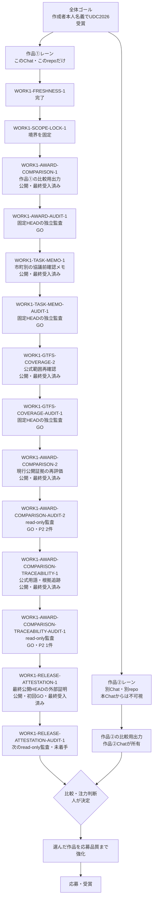

# 作品①の境界と全体DAG

このリポジトリは作品①「山口県 市町別の登録供給ビュー」だけを扱う。作品②は別Chat・別リポジトリが
所有し、このChatからはパス、ファイル、Git履歴、公開物を調べない。比較時に受け取れるのは、人が
転記した短い評価結果だけである。

## deny-by-defaultの三重ガード

1. `AGENTS.md`が、作品②の探索・読取り・変更・コマンド実行・委譲を禁止する。
2. `src/check_work_scope.py`が、実行位置、Git root、origin、候補パスを作品①のallowlistへ照合する。
3. `.github/workflows/work1-scope-lock.yml`と`tests/test_work_scope.py`が、境界をpush・PR・手動実行で検証する。

スコープロックが失敗した場合は安全停止とし、拒否対象を見に行かない。Gitリポジトリの規則だけでは
Windows全体のACLを変更できないため、OSレベルの物理的隔離が必要な場合は別Windowsアカウントまたは
アクセス許可を分けたworkspaceを使う。本プロジェクトでは、Chat・repo・CIの操作境界をdeny-by-default
にして作品②を入力にしない。

## 全体の位置づけ

作品①と作品②の間に直接の矢印はない。両作品が同じ評価形式の出力を人へ渡し、人だけが注力判断を行う。

## 現在地と次段階

- `WORK1-FRESHNESS-1`: 公開・最終受入済み。
- `WORK1-SCOPE-LOCK-1`: 公開・最終受入済み。作品①の操作境界を固定した。
- `WORK1-AWARD-COMPARISON-1`: 公開・最終受入済み。作品①の公開証拠だけで、実用度3.5、
  完成度4.0、挑戦度3.0、内部比較指数70.0 / 100を同一形式のスコアカードへ固定した。
- `WORK1-AWARD-AUDIT-1`: 固定HEAD、公開配信、採点計算、証拠リンク、作品②入力0件を
  read-onlyで独立監査し、GO判定済み。
- `WORK1-TASK-MEMO-1`: 既存の作品①公開データだけから、市町別に根拠・日付・限界・
  次の確認事項を一枚へ構成し、共有・印刷できる実務向け出力を公開・最終受入済み。
- `WORK1-TASK-MEMO-AUDIT-1`: 固定HEAD、公開配信、代表3分岐、PC・390px・印刷、
  作品②入力0件をread-onlyで独立監査し、GO判定済み。
- `WORK1-GTFS-COVERAGE-2`: 未確認14市町の公式資料を再探索し、新規採用0件、関連確認6/19市町、
  未確認13/19市町を公開・最終受入済み。原本と実測値は増やしていない。
- `WORK1-GTFS-COVERAGE-AUDIT-1`: 固定HEADと公開配信をread-onlyで監査し、P0 0件、P1 0件、
  P2 1件でGO。P2は有限な工程数と外部提出を終端にした状況表示である。
- `WORK1-AWARD-COMPARISON-2`: 受け入れ済み確認メモ、GTFS関連範囲、監査GOを作品①の現行公開証拠へ
  反映した。方法の妥当性だけを4.5へ更新し、3基準と総合70.0は据え置く。P2表示を継続改善へ
  訂正し、Actions、Pages、公開PC・スマホ読戻しまで最終受入済み。
- `WORK1-AWARD-COMPARISON-AUDIT-2`: 固定HEAD、計算、公開配信、継続改善表示、作品②入力0件を
  read-onlyで監査し、P0 0件、P1 0件、P2 2件でGO。P2は公式用語の揺れと根拠節の不足である。
- `WORK1-AWARD-COMPARISON-TRACEABILITY-1`: P2 2件だけを訂正し、比較スコアとスコアカードbytesを
  変えずに公式用語と根拠追跡を固定した。全テスト、Actions、Pages、公開PC・スマホ読戻しまで最終受入済み。
- `WORK1-AWARD-COMPARISON-TRACEABILITY-AUDIT-1`: 固定HEAD `a0fd712`、最終Actions、公開配信、
  全テスト、6原本、作品②入力0件をread-onlyで監査し、P0 0件、P1 0件、P2 1件でGO。
  P2は最終commit自身と後続run IDをrepo内へ機械記録できない自己参照である。
- `WORK1-RELEASE-ATTESTATION-1`: Pages成功後の外部artifactへ対象SHA、自身とPagesのrun ID、
  全テスト、公開3資産、6原本、作品①境界を固定する。初回artifactはcommit `3dd7693`、
  run `31646234472`でGO。最終HEAD自身も同じ自動処理で外部証明し、run IDをrepoへ書き戻さない。
- `WORK1-RELEASE-ATTESTATION-AUDIT-1`: RELEASE-ATTESTATION-1最終受入後の次の一作業。
  最終artifactと公開配信をread-onlyで監査する。現在は未着手。
- 作品①の公開出力: [受賞準備スコアカード](https://yyy-yuichi.github.io/yamaguchi-yusho-data/award-comparison.html)
- 作品①の実務出力: [市町別 交通協議前確認メモ](https://yyy-yuichi.github.io/yamaguchi-yusho-data/municipality-memo.html)
- 応募送信、本応募、BODIK登録、作品②の変更は別の人間承認・別Chatの責任範囲である。
