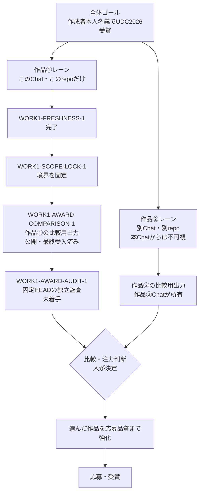

# 作品①の境界と全体DAG

このリポジトリは作品①「山口県 市町別の登録供給ビュー」だけを扱う。作品②は別Chat・別リポジトリが
所有し、このChatからはパス、ファイル、Git履歴、公開物を調べない。比較時に受け取れるのは、人が
転記した短い評価結果だけである。

## deny-by-defaultの三重ガード

1. `AGENTS.md`が、作品②の探索・読取り・変更・コマンド実行・委譲を禁止する。
2. `src/check_work_scope.py`が、実行位置、Git root、origin、候補パスを作品①のallowlistへ照合する。
3. `.github/workflows/work1-scope-lock.yml`と`tests/test_work_scope.py`が、境界をpush・PR・手動実行で検証する。

スコープロックが失敗した場合は安全停止とし、拒否対象を見に行かない。Gitリポジトリの規則だけでは
Windows全体のACLを変更できないため、OSレベルの物理的隔離が必要な場合は別Windowsアカウントまたは
アクセス許可を分けたworkspaceを使う。本プロジェクトでは、Chat・repo・CIの操作境界をdeny-by-default
にして作品②を入力にしない。

## 全体の位置づけ

作品①と作品②の間に直接の矢印はない。両作品が同じ評価形式の出力を人へ渡し、人だけが注力判断を行う。

## 現在地と次段階

- `WORK1-FRESHNESS-1`: 公開・最終受入済み。
- `WORK1-SCOPE-LOCK-1`: 公開・最終受入済み。作品①の操作境界を固定した。
- `WORK1-AWARD-COMPARISON-1`: 公開・最終受入済み。作品①の公開証拠だけで、実用度3.5、
  完成度4.0、挑戦度3.0、内部比較指数70.0 / 100を同一形式のスコアカードへ固定した。
- `WORK1-AWARD-AUDIT-1`: 次の一作業として定義済み、未着手。固定HEAD、公開配信、採点計算、
  証拠リンク、作品②入力0件をread-onlyで独立監査し、GO / NO-GOを判定する。
- 作品①の公開出力: [受賞準備スコアカード](https://yyy-yuichi.github.io/yamaguchi-yusho-data/award-comparison.html)
- 応募送信、本応募、BODIK登録、作品②の変更は別の人間承認・別Chatの責任範囲である。
